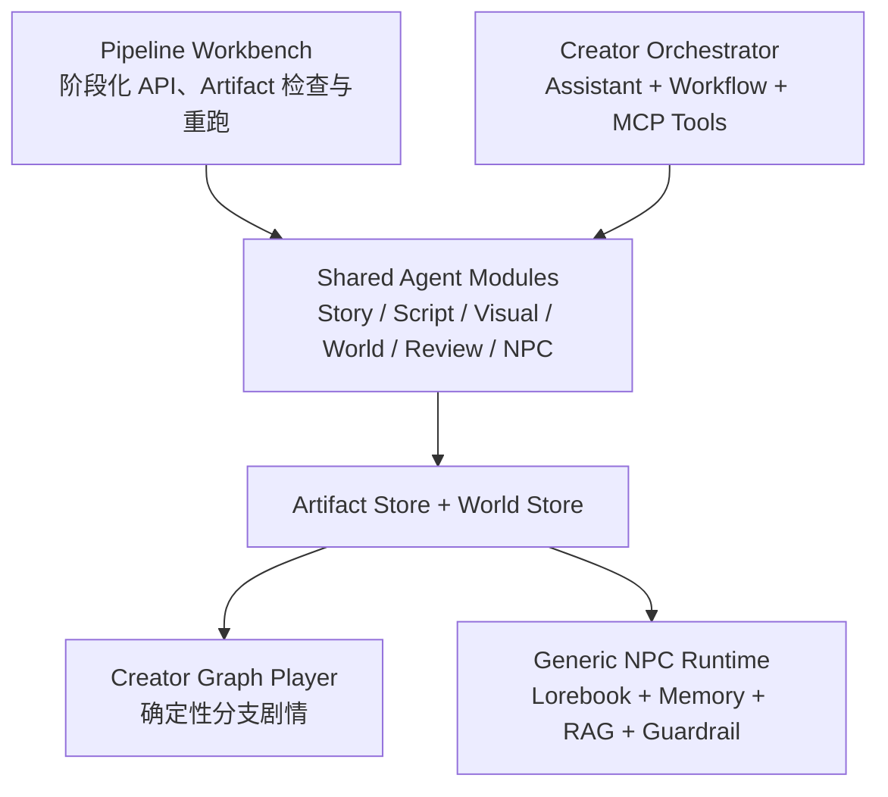

# 互动叙事多智能体框架（Interactive Fiction Multi-Agent Framework）

一套面向**文字冒险 / 互动小说游戏**的开源多智能体框架。它让**多个 Agent 在共享的叙事世界里分工、协作、可被生产部署**——剧情拆解、世界观构建、角色对话、试玩验证——并通过统一的模块边界、运行时持久化与确定性护栏，把多 Agent 叙事系统从「能演示的 Demo」推进到「能部署的生产系统」。

> 框架以文字冒险游戏为核心落地方向：玩家输入一句话，在场的多位角色 Agent 各自回应、世界状态随之推进。同一个底座的可插拔 Agent 模块，亦可延伸到其它需要「多自主实体在同一环境里协作」的互动场景。

> **参赛说明**：本项目报名 **GOAI 世界人工智能开源大赛 · 新智基座（Agent Infra）赛道**，作为「面向文字冒险游戏的开源多智能体协作基础设施」提交。代码仓库：`https://github.com/Zaosusu/goai-interactive-fiction-agents`

## 核心能力

- **多 Agent 角色编排与任务拆解**：把一段设定 / 剧本拆成子任务与结构化中间产物（剧情图谱、角色卡、世界设定）。
- **上下文传递与共享状态**：角色知识库（Lorebook）把世界观设定沉淀为可被对话激活的知识切片；运行时维护跨 Agent 的共享叙事状态。
- **工具 / LLM Provider 抽象可替换**：LLM、Embedding、图像生成、记忆均通过 Provider 抽象层接入，供应商可替换。
- **运行时持久化与跨进程恢复**：游戏会话与每个角色的私有状态可跨进程重启恢复。
- **确定性护栏（Guardrail）**：约束 Agent 不编造设定外的事实（如地点、人物关系），保证剧情输出可预期。
- **Corrective RAG + 记忆**：检索增强与私有记忆接入 Agent 循环，支持纠错式检索。
- **执行证据沉淀与可观测**：会话存储（Session Store）记录完整对话 / 执行轨迹，供审查与回放。
- **经验沉淀**：玩家 / 测试反馈回流，驱动后续生成质量提升。
- **项目内 Skill 标准**：Agent 能力收敛到 `app/agents/<agent_module>` 模块边界，新能力按统一标准接入。
- **MCP-shaped 工具边界**：`creator_assistant` 的 `CreatorMcpToolServer` 复用 MCP 的工具定义（`McpToolDefinition`）、注解（`McpToolAnnotations`）与结果信封（`McpTextContent` / `McpCallToolResult`）作为工具边界，实现 `tools/list`（`list_tools()`）与 `tools/call`（`call_tool()`）；当前经 `GET/POST /api/creator/mcp/tools/{list,call}` 以自定义 REST 暴露。该实现尚未挂载官方 MCP transport（无 JSON-RPC 层、无 `initialize` / capabilities 协商、无 stdio / SSE / Streamable HTTP 传输），且 `tools/call` 需额外携带 `project` 与 `artifacts` 上下文，因此标准 MCP Client 暂时不能直接连接。详见 [MCP_ARCHITECTURE.md](./MCP_ARCHITECTURE.md)。

## 架构概览（Agent Infra 视角）

本项目以 **Agent-module-first** 为能力边界：共享能力层位于 `app/agents/*`，由两种控制面**并行编排其中不同子集**——**Pipeline Workbench**（阶段化 API，可直接检查、重跑每个 Artifact）与 **Creator Orchestrator**（Assistant + Workflow + MCP Tools 的对话式创作）。各阶段以**可检查、可持久化的 Artifact** 交接，最终由**两种 Runtime** 消费，而非单一播放逻辑。



> 参赛定位：以 Agent-module-first 为能力边界，通过 Pipeline Workbench 和 Creator Orchestrator 两种控制面编排共享 Agent；各阶段以可检查、可持久化的 Artifact 交接，最终由 Creator Graph Player 或 Generic NPC Runtime 消费，实现从内容生产、质量验证到多 NPC 运行的完整闭环。

### 关键智能 Agent（编排图必须展开）

```text
StoryAuthoringAgent        StoryExpansionAgent         ScriptDecompositionAgent
WorldBuilderAgent          VisualPromptComposerAgent   VisualAssetGenerationAgent
NpcLorebookCreationAgent   NpcAgent                     CreatorAssistantAgent
```

当前名为 `WorldReviewAgent`、`NpcReviewAgent`、`PlaytestAgent` 的质量组件采用确定性规则实现，不调用 LLM；这些名称属于历史兼容命名，在架构角色上应视为 Review / Validator / Simulator，而不是智能 Agent。

另有 `ScriptGraphCompiler`、`CreatorGraphCompiler`、`VisualAssetBindingCompiler`、`ArtifactStore`、`WorldStore`、`PlayerSessionStore`、`SandboxWorldAdapter` 等确定性 Compiler / Validator / Store / Adapter。它们属于内部实现细节，隐藏在产品总览图里是合理的，但在完整执行图中必须展开。

## Agent 模块清单（app/agents）

| 模块 | 职责 |
|---|---|
| `project_intake` | 项目 / 设定 / 接口文档结构化接入 |
| `script_decomposition` | 剧本与任务拆解 |
| `story_authoring` / `story_expansion` | 剧情创作与扩展 |
| `visual_prompt_composer` | 视觉提示词生成 |
| `visual_asset_generation` | 视觉资产生成 |
| `world_builder` | 世界 / 环境构建 |
| `world_review` / `npc_review` | 产出审查 |
| `npc_lorebook` | 角色知识库（可热插拔进任意故事世界） |
| `npc_runtime` | 角色运行时（私有记忆 / 私有状态） |
| `playtest_validation` | 试玩 / 验证 |
| `experience_learning` | 经验沉淀 |
| `creator_assistant` | 创作者辅助（含 MCP 形态工具边界：`CreatorMcpToolServer`） |
| `ui_projection` | 对外的 UI / 接口投影 |

（注：`npc_*` 命名来自文字冒险游戏的参考实现「角色 / NPC 协同」，模块能力本身是通用的。）

## 三模块架构（Pipeline / Creator / Play）

本框架在概念与产物流上由三个模块构成闭环：**Pipeline**（`app/pipeline/` 为 REST 入口）暴露 `app/agents/*` 中更广泛的阶段化创作能力；**Creator**（`app/agents/creator_assistant/`）编排共享能力层中的创作者工作流子集——`StoryAuthoringAgent`、`StoryExpansionAgent`、`VisualAssetGenerationAgent`、`WorldReviewAgent`、`PlaytestAgent`——并把成果 `save_world` 编译为 `SandboxWorldConfig`；**Play**（`app/player_experience/`）的 Creator Graph Player 仅消费经过 Creator 编译并发布的 `SandboxWorldConfig` 世界信封（要求 `metadata.published_to_play == true` 且 `metadata.creator_graph` 有效），普通 Pipeline 世界由 Generic NPC Runtime 消费。Creator 另以 MCP-shaped 工具边界（`tools/list` + `tools/call`）作为标准化出口。详见 [TECHNICAL_ARCHITECTURE.md](./TECHNICAL_ARCHITECTURE.md) 第 21 节与 [MCP_ARCHITECTURE.md](./MCP_ARCHITECTURE.md)。

## 快速开始

```bash
pip install -r requirements.txt
cp .env.example .env   # 填入 LLM / Embedding / 图像生成等 API Key
.\start_backend.ps1   # 启动后端
```

详见 [TECHNICAL_ARCHITECTURE.md](./TECHNICAL_ARCHITECTURE.md)、[AGENT_DEVELOPMENT_STANDARD.md](./AGENT_DEVELOPMENT_STANDARD.md) 与 [MCP_ARCHITECTURE.md](./MCP_ARCHITECTURE.md)。

## 开源协议

Apache-2.0。详见 [LICENSE](./LICENSE)。
